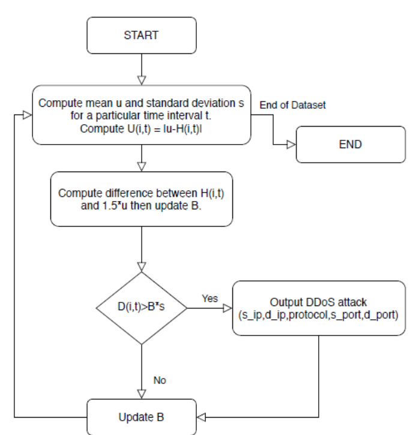

# Giải thuật phát hiện DDoS Attack (Thông qua tính toán độ nhạy Entropy)
---
## Giải thuật
1. Xác định độ nhạy Entropy về sự truy cập của các địa chỉ IP
2. Xác định số lần truy cập đến để xác định lưu lượng
3. Tính độ khuyếch đại (GainRatio) để thống kê sự tăng/giảm của Entropy
4. Phân tích dựa vào thuật toán C4.5 Decicion tree thông qua việc chênh lệch Entropy từ đó liệt kê các địa chỉ IP đang truy cập bất thường
---
## Sơ đồ giải thuật

---
## Compile
```
git clone https://github.com/phamminh03/ddosAttack.git
g++ ddosAttack.cpp -o ddosAttack
```
---
### Run
```
./ddosAttack data.txt
```
